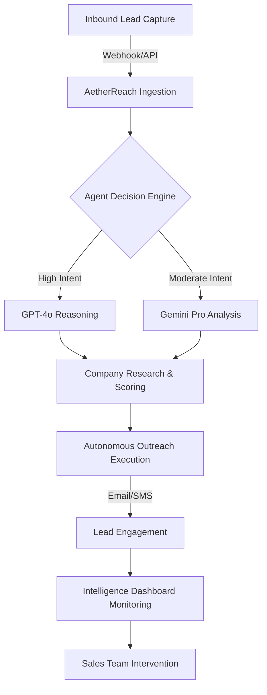

# 🤖 AetherReach AI — Enterprise Sales Intelligence Engine

[](https://opensource.org/licenses/MIT)
[](https://www.python.org/)
[](https://react.dev/)
[](https://fastapi.tiangolo.com/)

**AetherReach AI** is a production-grade, autonomous engine designed for high-volume lead engagement and sales orchestration. Built for SaaS enterprises and growth-driven teams, it leverages multi-model intelligence (GPT-4o, Gemini, Claude) to qualify, research, and engage leads across global channels in under 60 seconds.

<div align="center">

**[Installation](#-quick-start)** •
**[Core Features](#-core-features)** •
**[Architecture](#-enterprise-architecture)** •
**[Intelligence Layer](#-ai--intelligence-layer)** •
**[Tech Stack](#-tech-stack)**

</div>

---

## 👤 Project Vision & Oversight

| Role | Details |
|---|---|
| **Lead Architect** | Ismail Sajid |
| **Status** | Production-Ready (v1.0.0) |
| **Focus** | Sales Intelligence, Autonomous Agents, Lead Orchestration |

---

## 🎯 Why AetherReach AI?

Standard sales flows suffer from slow response times and generic automation. **AetherReach AI** solves this by treating every lead as a high-value opportunity through:

*   ⚡ **The 60-Second Rule:** Infinite scalability to respond to every inbound lead instantly.
*   🧠 **Deep Context Research:** AI-driven analysis of company profile, sentiment, and user intent.
*   🤝 **Hyper-Personalization:** Generating bespoke communication that feels human and conversion-focused.
*   📊 **Operational Transparency:** A real-time intelligence dashboard for full visibility into AI decision-making.

---

## ✨ Core Features

| Feature | Technical Impact | Capability |
|:--- |:--- |:--- |
| 🧠 **Multi-Model Intelligence** | Dynamic Routing | Switches between GPT-4o, Gemini, and Claude based on task complexity. |
| 🎯 **Predictive Lead Scoring** | Intent Prediction | Advanced algorithms to score leads (0.0 - 1.0) based on urgency and value. |
| 📬 **Autonomous Follow-Up** | Multi-Channel Execution | Executes sequences across Email (SendGrid) and SMS (Twilio) automatically. |
| 📊 **Sentiment Analytics** | NLP & Emotion Detection | Real-time sentiment analysis (Positive/Neutral/Negative) for strategic routing. |
| 📅 **Calendar Orchestration** | Automated Scheduling | Seamlessly books meetings by checking real-time availability. |
| 🔗 **Enterprise Integration** | Bridge Connectors | Pre-built support for GoHighLevel, Salesforce, and HubSpot workflows. |

---

## 📂 Enterprise Architecture

```bash
├── backend/                # FastAPI Autonomous Core
│   ├── app/                # Application Domain
│   │   ├── api/            # API v1 Versioning & Endpoints
│   │   ├── core/           # Security, Logging, and Middleware
│   │   ├── models/         # Scalable Database Schemas (Lead, Interaction)
│   │   ├── services/       # AI Engine, Messaging, and Personalization
│   ├── requirements.txt    # Optimized Dependency Tree
│   └── Dockerfile          # Multi-stage Backend Container
├── frontend/               # React 18 / TypeScript Dashboard
│   ├── src/                # Modular UI Layer (Clean Architecture)
│   │   ├── components/     # High-end Component Library (Glassmorphism)
│   ├── tailwind.config.js  # Professional Design System
│   └── Dockerfile          # Production Frontend Container
├── docker-compose.yml      # Orchestrated Service Layer (PG, Redis, App)
└── CHANGELOG.md            # Version Control & Evolution History
```

---

## 🏗️ System Flow (Expert Overview)



---

## 🚀 Quick Start (Local Development)

### 1. Environment Setup
```bash
git clone https://github.com/bsuprints216/AetherReach-AI-.git
cd AetherReach-AI-
cp backend/.env.example backend/.env
```

### 2. Launch Services
The platform is fully containerized for consistency.
```bash
docker-compose up --build
```

### 3. Portal Access
- **Intelligent Dashboard:** `http://localhost:5173`
- **Interactive Documentation:** `http://localhost:8000/docs`

---

## 🛠️ Tech Stack

*   **Backend:** Python 3.11, FastAPI, SQLAlchemy, Celery (Async Processing).
*   **AI Tier:** OpenAI GPT-4o, Google Gemini API, Custom Predictive Models.
*   **Frontend:** React 18, TypeScript, TailwindCSS, Framer Motion (Glassmorphism UI).
*   **Infrastructure:** PostgreSQL (Relational Data), Redis (Cache & Task Queue), Docker.
*   **Messaging:** Twilio (SMS), SendGrid (Email).

---

## 📄 License & Mission

AetherReach AI is built with the mission to humanize scale. Every line of code is optimized for reliability and performance.

**License:** MIT License © 2026 Ismail Sajid
